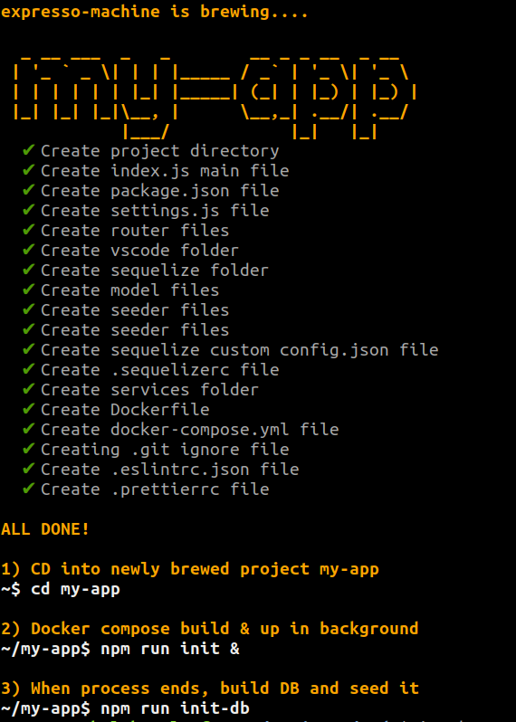
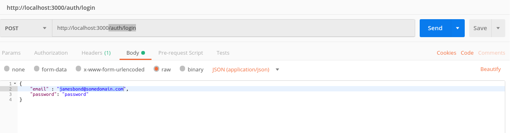
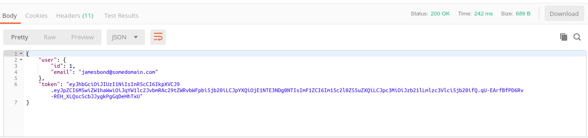
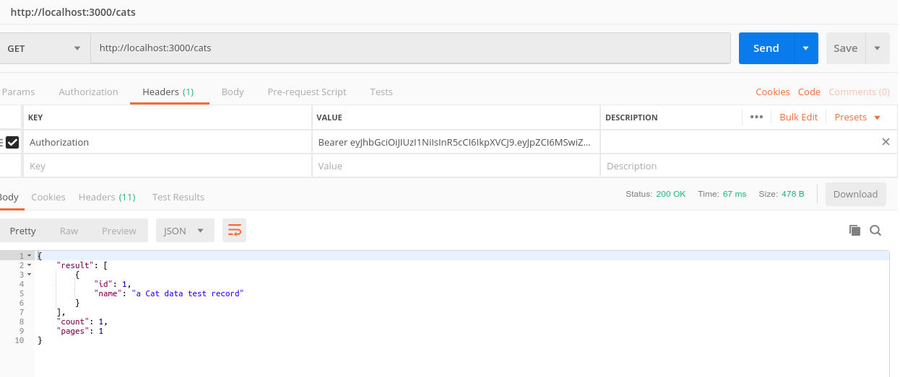
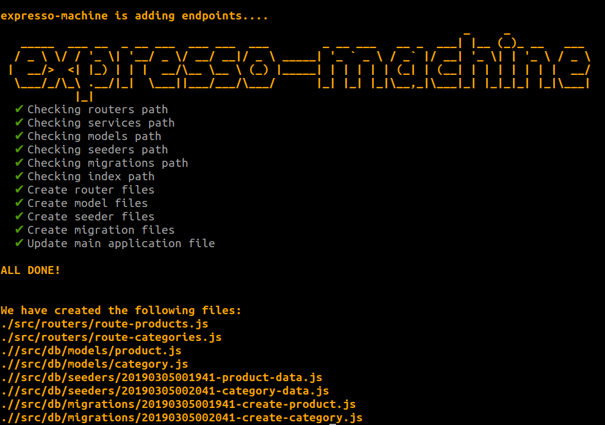

# WELCOME TO THE EXPRESSO-MACHINE PROJECT


## EXPRESS JS API CLI APPLICATION GENERATOR

### ABOUT EXPRESSO-MACHINE

Expresso-machine is a CLI utility to generate an express js app featuring:

-   Express application skeleton
-   REST API CRUD generation - GET, POST, PUT, DELETE HTTP methods implementation for each API endpoint defined in cli command
-   Generation of an initial SEQUELIZE model, migration, seed & configuration files for models defined in cli options
-   Dockerfile & docker-compose.yml files generated for out-of-the-box project docker virtualization
-   VISUAL CODE configuration for out-of-the-box debugging
-   JWT initial implementation for API endpoints protection
-   Validation schema initial definition for each RESTFUL endpoint generated
-   eslint configuration
-   prettier configuration
-   'expresso-machine' (alias 'em') command line interface to generate a brand new application express-app
-   'expresso-machine-add-api-endpoints' (alias 'em-add-api-endpoints') cli to add extra endpoints to an existing project (api implementation, JWT protection and Sequelize models/migration/seeder files)

### PRE-REQUISITES

As expresso-machine dockerizes the generated expressjs app, it would be beneficial to have the **docker** and **docker-compose** commands installed in your machine. In windows environents when working with bash I suggest using Window's **Power Shell**

## em-machine CLI ( alias 'em')

### GET STARTED

```
npm install -g expresso-machine
```

This will install the cli expresso command at global level. Once the installation process completes run the following command:

```
expresso-machine -h
```

You should get the following output or similar:

```
Usage: expresso-machine -i my-app l- product,category

Options:
  -V, --version                output the version number
  -i, --init <projectname>     Creates a project named <projectname> (default: "my-app")
  -p, --port [port]            Set the port the node app is exposed on [port] (default: 3000)
  -P, --dbport [dbport]        Set the port database is exposed on [dbport] (default: 5433)
  -o, --overwrite              Overwrite project folder if already existing
  -d, --dbDialect [dbDialect]  Enter the database [dbDialect] you would like to use: postgres, sqlite, mssql or mysql (default: "postgres")
  -l, --list <apiEndpoints>    A list of api properties <apiEndpoints>, comma-separated (default: ["product","category"])
  -h, --help                   output usage information

```

### EXAMPLE

At this point you are ready to start generating express js apps! Take a look at the following example command to run:

```
expresso-machine -i my-app -l dog,cat
```



This command will create a 'my-app' folder with a ready to run dockerized application. CD into the folder:

```
cd my-app
```

Run the following command as a background process:

```
npm run init &
```

This command will run docker-compose build and the overall app. Wait until this process completes in the background. When it does run:

```
npm run init-db
```

This will create a sequelize migration and create the Dog, Cat tables as well as the seeding process to create a record for each table.

The application exposes the following endpoints on default port 3000:

```
GET localhost:3000/dogs/ (all paginated dogs)
GET localhost:3000/dogs/:id (get a dog with id <:id>)
POST localhost:3000/dogs/ (create a dog, you must include the 'dog' object in the request body)
PUT localhost:3000/dogs/:id (update a dog, you must include the 'dog' object in the request body and 'id' <:id>)
DELETE localhost:3000/dogs/:id (delete dog with 'id' :id)

```

```
GET localhost:3000/cats/ (all paginated cats)
GET localhost:3000/cats/:id (get a cat with id <:id>)
POST localhost:3000/cats/ (create a cat, you must include the 'cat' object in the request body)
PUT localhost:3000/cats/:id (update a cat, you must include the 'cat' object in the request body and 'id' <:id>)
DELETE localhost:3000/cats/:id (delete cat with 'id' :id)
```

## GRAB A JWT TOKEN

Once you seed the db an user is created with the following credentials:

-   email: jamesbond@somedomain.com
-   password: password

You can use POSTMAN or another REST client to post to the credentials to the **/auth/login** endpoint. I.e.



Run the request and get the token:



Copy the the token and include it in an authorization header key and hit the GET endpoints to return all 'cats' (i.e. http://localhost:3000/cats) and get a seeded record as generated by **expresso-machine**:



## 'expresso-machine-add-api-endpoints' CLI (alias 'em-add-api-endpoints')

When you install **expresso-machine** another command will be made available globally: **expresso-machine-add-api-endpoints** or **em-add-api-endpoints**

Check it out:

```
em-add-api-endpoints -h
```

```
Usage: expresso-machine-add-api-endpoints l- product,category

Options:
  -V, --version              output the version number
  -l, --list <apiEndpoints>  A list of api properties <apiEndpoints>, comma-separated (default: [])
  -h, --help                 output usage information
```

Use this command when you cd into a project folder generated by **expresso-machine**

```
cd my-app
```

Then run the **expresso-machine-add-api-endpoints** command followed by the **-l** option with a comma-separated list of endpoint domains to add to your project i.e.

```
expresso-machine-add-api-endpoints -l
```

**expresso-machine** will generate the following files within the **my-app** project directory:

./src/routers/route-products.js
./src/routers/route-categories.js
./src/db/models/product.js
./src/db/models/category.js
./src/db/seeders/20190305001941-product-data.js
./src/db/seeders/20190305002041-category-data.js
./src/db/migrations/20190305001941-create-product.js
./src/db/migrations/20190305002041-create-category.js

./index.js will also be amended so the route will be added.



## NPM BUILT-IN COMMANDS IN GENERATED APP

-   **npm run init** - initialize project running `docker-compose build && docker-compose up` to install project dependencies and create docker containers and starts them
-   **npm run init-db** - short version to run database migrate and seed operations
-   **npm test** - runs jest tests
-   **npm run test-coverage** - produces a jest coverage report
-   **npm run start** - starts application with nodemon
-   **npm run debug** - starts application with nodemon & debugger for VS Studio code
-   **npm run dockerbuild** - runs `docker-compose build`
-   **npm run dockerup** - runs `docker-compose up`
-   **npm run erase-db** - runs the `docker exec -it my-app_web_1 ./node_modules/.bin/sequelize db:migrate:undo:all` from host OS into container and undoes SEQUELIZE migration
-   **npm run migrate** - runs the `docker exec -it my-app_web_1 ./node_modules/.bin/sequelize db:migrate` from host OS into container and generates SEQUELIZE migration
-   **npm run seed** - runs the `docker exec -it my-app_web_1 ./node_modules/.bin/sequelize db:seed:all` from host OS into container and performs SEQUELIZE database seed operation
-   **npm run go-into-container** - runs the `docker exec -it my-app_web_1 /bin/ash` to log into the docker container via shell

## TO DO

```
* Adding a facility to the **expresso-machine** to also add templates (i.e. nunjucks or other template engines) and an extra CLI to add extra routes & templates.
```
